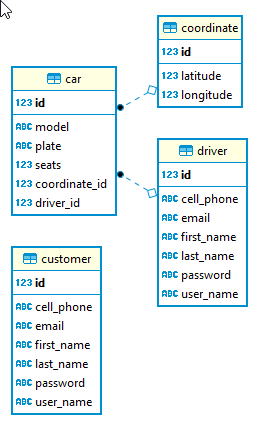

# Synchdrive

## Integrantes
* [Julian Benitez](https://github.com/julianbenitez99)
* [Luis Pizza](https://github.com/luis572)
* [Juan Ospina](https://github.com/QSARJP)

## Indice
* [Resumen](#resumen)
* [Arquitectura Backend - Synchdrive](#arquitectura-backend---synchdrive)
    * [Diagrama de Clases - Modelo](#diagrama-de-clases---modelo)
    * [Diagrama de Entidad-Relación](#diagrama-de-entidad-relación)
    * [Diagrama de Componentes](#diagrama-de-componentes)
* [Arquitectura Backend - Uber](#arquitectura-backend---uber)
    * [Diagrama de Clases - Modelo - Uber](#diagrama-de-clases---modelo-uber)
    * [Diagrama de Entidad-Relación - Uber](#diagrama-de-entidad-relación---uber)
    * [Diagrama de Componentes - Uber](#diagrama-de-componentes---uber)
* [Arquitectura Backend - Beat](#arquitectura-backend---beat)
    * [Diagrama de Componentes - Beat](#diagrama-de-componentes---Beat)
* [Arquitectura Backend - Didi](#arquitectura-backend---didi)
    * [Diagrama de Componentes - Didi](#diagrama-de-componentes---didi)
* [Arquitectura Frontend](#arquitectura-frontend)
* [Arquitectura Despliegue](#arquitectura-despliegue)
* [Diagrama de Casos de uso](#diagrama-de-casos-de-uso)
* [Atributos No Funcionales](#atributos-no-funcionales)
    * [Usabilidad](#usabilidad)
    * [Escalabilidad](#escalabilidad)
    * [Disponibilidad](#disponibilidad)
    * [Rendimiento (Performance)](#rendimiento)
* [Continuidad de desarrollo - Github](#continuidad-de-desarrollo---github)
* [Despliegue - Heroku](#despliegue---heroku)
* [Manual de Uso](#manual-de-uso)
* [Enlace a las Historias de Usuario](#enlace-a-las-historias-de-usuario)
* [Estado del Backend de Synchdrive](#estado-del-backend-de-synchdrive)

## Resumen
Actualmente se ofrece una gran variedad de aplicaciones que proporcionan el servicio de transporte contactando a los pasajeros con los vehículos registrados en sus plataformas. Esto resulta beneficioso tanto para el conductor generando utilidades con su automóvil, como para el pasajero que pueden viajar a gusto. El problema radica en que la mayoría de los conductores y usuarios manejan dos o más de las aplicaciones móviles disponibles, les resulta tedioso tener que abrir y cerrar las aplicaciones, en el caso de los usuarios para comparar precios, servicios y solicitar diversos servicios, como para los conductores a la hora de buscar y aceptar los servicios. Tomando en cuenta esta problemática surgió Synchdrive una aplicación web en donde los diferentes usuarios podrán interactuar con las diferentes aplicaciones de transporte en las que estén registrados para poder así tomar la mejor decisión en cuanto al servicio que se requiera según el caso.

## Arquitectura Backend - Synchdrive
El backend se está desarrollando en el siguiente [repositorio](https://github.com/arsw-starsoft/Synchdrive-Backend)
### Diagrama de Clases - Modelo

### Diagrama de Entidad-Relación

### Diagrama de Componentes

## Arquitectura Backend - Uber
El backend se está desarrollando en el siguiente [repositorio](https://github.com/arsw-starsoft/Uber-Backend)
### Diagrama de Clases - Modelo - Uber

### Diagrama de Entidad-Relación - uber

### Diagrama de Componentes - Uber

## Arquitectura Backend - Beat

### Diagrama de Componentes - Beat

## Arquitectura Backed - Didi

### Diagrama de Componentes - Didi

## Arquitectura Frontend

## Arquitectura Despliegue

### Diagrama de casos de uso

## Atributos No Funcionales

### Usabilidad
#### Escenarios
Escenarios de pedir/aceptar servicios.
1. **Source:** Usuario final (Conductor/Usuario del aplicativo).
2. **Stimulus:** Usar el sistema eficientemente.
3. **Artifact:** Servidores Frontend, servidor backend, servidores de bases de datos, servidores de aplicativos externos.
4. **Enviroment:** Aplicación ejecutandose en condiciones normales.
5. **Response:** Es sencillo, tanto para pedir como aceptar servicios, a cada tipo de usuario.
6. **Response Measure:** El conductor realiza 1 click para aceptar un servicio. El usuario, después de configurar sus preferencias y destino, realiza 1 click para solicitar el servicio.

Escenario

Escenarios de visualización de historial de servicios.
1. **Source:** Usuario final (Conductor/Usuario del aplicativo).
2. **Stimulus:** Verificar que el sistema haya registrado correctamente la toma de un servicio.
3. **Artifact:** Servidores Frontend, servidor backend, servidores de bases de datos.
4. **Enviroment:** Aplicación ejecutandose en condiciones normales.
5. **Response:** Facilidad para identificar los servicios que se han aceptado/pedido.
6. **Response Measure:** Tanto el usuario como el conductor ingresan con un click a sus historiales.

Escenario Conductor

Escenario Usuario

### Escalabilidad

#### Escenarios 
1. **Vertical:**
Escenario de escalamiento vertical para la base de datos de la aplicación principal.
    1. **Source:** Usuarios finales.
    2. **Stimulus:** Al momento de solicitar servicios.
    3. **Artifact:** Servidor Backend, Servidores Frontend, servidor de base de datos.
    4. **Enviroment:** En condiciones de ejecución normales.
    5. **Response:** Se guardan los servicios generados en la base de datos.
    6. **Response Measure:** La respuesta del servidor es, en promedio, 10ms más rápida con el escalamiento vertical.

[Link al video](gifs/ScalabilityDB.mp4)

2. **Horizontal:**
Escenario de escalamiento horizontal para servidor externo "Uber".
    1. **Source:** Usuarios finales.
    2. **Stimulus:** Interactuar con cualquier funcionalidad de la aplicación.
    3. **Artifact:** Servidor externo Uber.
    4. **Enviroment:** En condiciones de ejecucíon normales.
    5. **Response:** El balanceador de carga, dependiendo del estado de la máquina, realiza la petición a dicha máquina.
    6. **Response Measure:** La respuesta es aproximadamente 200ms más rápida que tener un solo servidor.

[Link al video 1](gifs/Escalabilidad2-HerokuUber.mp4)

[Link al video 2](gifs/Escalabilidad2-AWSUber.mp4)

### Disponibilidad
#### Escenarios 
Escenario de escalamiento horizontal para servidor externo "Uber".

1. **Source:** Usuarios finales.
2. **Stimulus:** Pedir un servicio.
3. **Artifact:** Servidor externo Uber.
4. **Enviroment:** En condiciones de falla de un servidor externo.
5. **Response:** El balanceador de carga detecta que una máquina quedó inactiva.
6. **Response Measure:** Ninguna petición realizada al servidor externo "Uber" es denegada.

[Link al video](gifs/Disponibilidad1-AWSUber.mp4)

1. **Source:**
2. **Stimulus:**
3. **Artifact:**
4. **Enviroment:**
5. **Response:** 
6. **Response Measure:**

[Link al video](gifs/cache-ok.mp4)

### Rendimiento (Performance)
#### Escenarios 
Escenario de aceptar servicio 
1. **Source:** Usuario final (Conductor)
2. **Stimulus:** El tiempo que toma entre aceptar un servicio un conductor y se le notifique a todos los conductores.
3. **Artifact:** Servidores Frontend, servidor backend, servidores de bases de datos.
4. **Enviroment:** Aplicación ejecutandose en condiciones normales.
5. **Response:** El servicio tomado se desaparece del resto de conductores.
6. **Response Measure:** Cuando un conductor acepta un servicio se demora menos de 1 segundo notificar al resto.

[Link al video](gifs/Performance1-AcceptDriver.mp4)

Escenario notificación que se ha aceptado un servicio
1. **Source:** Usuario final (Usuario del aplicativo)
2. **Stimulus:** El tiempo que toma un usuario en ver que un conductor ha tomado el servicio.
3. **Artifact:** Servidores Frontend, servidor backend, servidores de bases de datos.
4. **Enviroment:**Aplicación ejecutandose en condiciones normales.
5. **Response:** El usuario cambia de pestaña al momneto de que un conductor acepete el servicio. 
6. **Response Measure:** Cuando un conductor acepta un servicio, el usuario cambia de pestaña en menos de 1 segundo.

[Link al video](gifs/Performance2-FinishService.mp4)

## Continuidad de desarrollo - Github
El proyecto se está desarrollando en la organización [arsw-starsoft](http://github.com/arsw-starsoft)

## Despliegue - Heroku
El despliegue se realizó en [Heroku](https://arswsynchdrive.herokuapp.com)

## Manual de Uso

En el siguiente enlace podemos encontrar la página inicial de la aplicación, aquí se puede elegir el registro ya sea de conductor o usuario y los respectivos login.

[Pagina de incio](arswsynchdrive.herokuapp.com)

### User
* Cuando le damos la opción de Sign Up User encontraremos 3 casillas las cuales nos permitirán tener la información básica de la aplicación como lo es el username, el correo y la contraseña.

Cuando se le da la opción de Sign Up este nos avisara por medio de una notificación si ha sido exitosa o no. Si es exitosa nos redirigía hacia otro enlace que el cual contiene el respectivo login.

* En el enlace de login podremos colocar el respectivo correo electrónico con el cual nos registramos y la contraseña, cuando seleccionamos el botón de login podremos acceder a la aplicación siendo usuario de las aplicaciones de transporte. 

* En el perfil del usuario podremos acceder a toda la información que se tiene dentro de la aplicación desde ahí podremos actualizar los datos suministrados.

* Si se desea realizar cualquier modificación de la información se debe acceder a los espacios asignados dependiendo de lo que se quiera modificar ya sea desde información básica como nombre hasta las cuentas asociadas que se pueden tener y luego accionar el botón de update user, Luego nos aparecerá un mensaje el cual nos dirá el estado de la petición, si es exitosa podremos ver que la información ha sido cambiada y cada vez que se intente acceder al perfil esta información se mantiene.

Por último, se podrá acceder a los servicios prestados por la aplicación donde el usuario podrá elegir los diferentes tipos de servicios que desea dependiendo de las aplicaciones seleccionadas los filtros necesarios y numero que desee pedir. y además podrá ver el mapa la ubicación donde se encuentra el usuario al momento de pedir un servicio.

### Driver
* Cuando le damos la opción de Sign Up Driver encontraremos 4 casillas las cuales nos permitirán tener la información básica de la aplicación como lo es el username, el correo, la contraseña y el numero de celular.

Cuando se le da la opción de Sign Up este nos avisara por medio de una notificación si ha sido exitosa o no. Si es exitosa nos redirigía hacia otro enlace que el cual contiene el respectivo login.

* En el enlace de login podremos colocar el respectivo correo electrónico con el cual nos registramos y la contraseña, cuando seleccionamos el botón de login podremos acceder a la aplicación siendo usuario de las aplicaciones de transporte. 

* En el perfil del driver podremos acceder a toda la información que se tiene dentro de la aplicación desde ahí podremos actualizar los datos suministrados.

* Si se desea realizar cualquier modificación de la información se debe acceder a los espacios asignados dependiendo de lo que se quiera modificar ya sea desde información básica como nombre hasta las cuentas asociadas que se pueden tener y luego accionar el botón de update user, Luego nos aparecerá un mensaje el cual nos dirá el estado de la petición, si es exitosa podremos ver que la información ha sido cambiada y cada vez que se intente acceder al perfil esta información se mantiene.

Por último, se podrá acceder a los servicios prestados por la aplicación para el conductor, donde el podrá elegir los diferentes tipos de servicios que desea ofrecer en las aplicaciones que seleccione y también el tipo de servicios que desea ver con prioridad dependiendo de los filtros escogidos. Además podrá ver la posición exacta del conductor en el mapa que se ve en la imagen.

## Enlace a las Historias de Usuario

## Estado del Backend de Synchdrive

